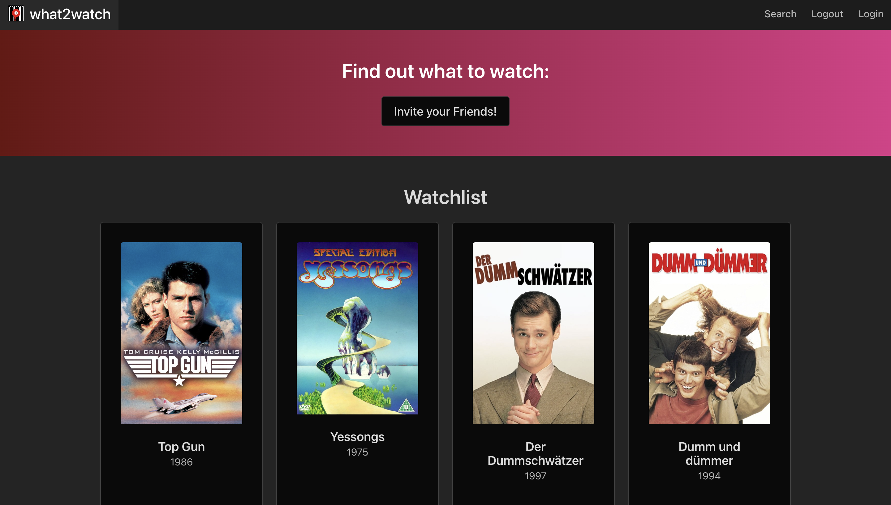

# What2Watch
Ever sat down with a friend to watch a movie/TV Series and couldn't decide on the best movie to watch?

## **That's where What2Watch comes in!**
What2Watch allows you to invite a friend to discover your preferences in Video Streaming and quickly recommends you a movie that fits **both** of your needs.

No more endlessly arguing about what you can watch with your friends.

## Technologies
The What2Watch frontend is built using VueJS and we've decided to build our backend using Golang and the open-source database framework PocketBase.
